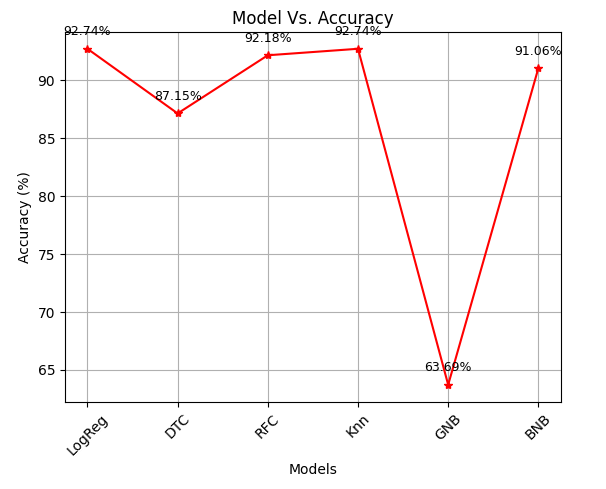

# Absenteeism at Work - Data Analysis & Machine Learning Project

## Table of Contents
1. [Introduction](#introduction)
2. [Project Overview](#project-overview)
3. [Data Preprocessing](#data-preprocessing)
4. [Model Training & Evaluation](#model-training--evaluation)
5. [Fine-Tuning the Best Model](#fine-tuning-the-best-model)
6. [Results](#results)
7. [Final Testing](#final-testing)
8. [Conclusion](#conclusion)
9. [Future Work](#future-work)

## Introduction

This project focuses on analyzing absenteeism data from employees and building machine learning models to predict absenteeism based on various features. The dataset undergoes comprehensive preprocessing, followed by training multiple models and fine-tuning them to improve accuracy.

## Project Overview

- **Data Analysis**: We performed thorough data analysis using Jupyter Notebooks, identifying key trends and patterns in absenteeism.
- **Data Preprocessing**: Various techniques like data cleaning, encoding categorical variables, scaling numerical features, and grouping the data were applied to prepare the data for machine learning models.
- **Model Training**: We trained multiple machine learning models and evaluated their performance using metrics such as accuracy and cross-validation.
- **Fine-tuning**: The best-performing model was fine-tuned using **GridSearchCV** and **Optuna** to improve its accuracy.
- **Final Testing**: After fine-tuning, we tested the model on a hold-out test set and saved the final model for later use.

## Data Preprocessing

The data preprocessing steps were carried out to prepare the raw dataset for model training. The steps included:

- **Data Cleaning**: Removed any missing or inconsistent data points.
- **Encoding**: Categorical variables were encoded using techniques such as One-Hot Encoding.
- **Scaling**: Features were scaled to bring them to a similar range, improving the model’s performance.
- **Grouping**: Grouped the feature values based on some arbitrary threshold to create meaningful subsets for analysis. 

Multiple cleaned datasets were saved for various stages of analysis and modeling.

## Model Training & Evaluation

We trained several machine learning models, including Logistic Regression, Decision Trees, Random Forest, and more. The following steps were involved:

- **Model Training**: We trained each model on the cleaned data using 75% of the dataset for training and 25% for testing.
- **Model Evaluation**: Models were evaluated using metrics such as accuracy, confusion matrix, classification report (precision, recall, and F1-score). Cross-validation was performed to assess model performance across different subsets of data.

## Fine-Tuning the Best Model

After training and evaluating multiple models, we selected the **Logistic Regression** model as the best performer based on its accuracy. The fine-tuning process involved the following:

1. **GridSearchCV**: We used **GridSearchCV** to search for the best hyperparameters for the Logistic Regression model. This involved trying various combinations of parameters to find the best-performing one.
   
2. **Cross-validation**: Cross-validation was applied during grid search to ensure the model’s robustness and avoid overfitting.

3. **Optuna**: We then used **Optuna**, an optimization framework, to further fine-tune the best model by automating the process of hyperparameter search.

The result was an improvement in the accuracy of the Logistic Regression model, reaching an accuracy of approximately **94%**.

## Results

In the first attempt, before fine-tuning, the accuracy of the Logistic Regression model was much lower. After applying the GridSearchCV and Optuna fine-tuning, we achieved an accuracy of 94%. The performance of the model before fine-tuning is shown in the following plot:


*Figure 1: Accuracy of the Logistic Regression model before fine-tuning.*

## Final Testing

After fine-tuning the Logistic Regression model, we saved the best model using the `joblib` library. We then conducted final testing on the saved model, ensuring that it performed well on unseen data.

The final model was able to make accurate predictions on the test set, confirming that the fine-tuning process led to a significant performance improvement.

## Conclusion

This project successfully demonstrated the power of data preprocessing and model fine-tuning in machine learning. By applying techniques like GridSearchCV and Optuna, we significantly improved the performance of the Logistic Regression model, achieving a high accuracy of 94%.

## Future Work

Future improvements could include:

- **Ensemble Models**: Exploring ensemble techniques such as Random Forest and XGBoost for potentially better performance.
- **Feature Engineering**: Further refining the features to improve predictive power.
- **Deployment**: Deploying the model to a web application or API to predict absenteeism in real-time.

---

### How to Run the Project

1. Clone this repository to your local machine:
   ```bash
   git clone https://github.com/your-username/Absenteeism-at-work.git
   ```

2. Install the required dependencies:
   ```bash
   pip install -r requirements.txt
   ```

3. Run the Jupyter Notebook `Absenteeism_Data_Analysis.ipynb` for data preprocessing and analysis.

4. Train and evaluate the machine learning models in `Absenteeism_Machine_Learning.ipynb`.
